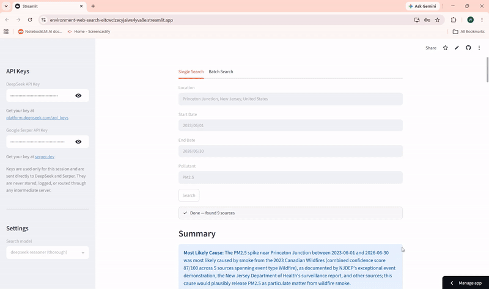

# Environment Web Search

A Streamlit app that helps explain **why** a pollutant spike happened. Give it a location, a date range, and a pollutant, and it searches the web for real-world events — wildfires, industrial accidents, chemical spills, power plant emissions — that could plausibly account for the spike, then ranks and synthesizes the evidence into a single, sourced conclusion.

**[Try it live →](https://environment-web-search-eitcwclzecyjaiws4yva8e.streamlit.app/)**

(Note, may take ~20-30 seconds to wakeup.)



## How it works

1. **Search** — An LLM agent (DeepSeek) is given the location, date range, and pollutant, and repeatedly calls a web search tool (via the Serper API) to look for explanatory events. It's steered through a fixed priority order: government sources first (EPA, AirNow, NOAA, CDC, state environmental agencies, CSB, NTSB, NIFC), then academic sources (PubMed, Google Scholar, ScienceDirect), then general news, running at least 5 searches per round.
2. **Filter & rank** — A second LLM pass throws out irrelevant results (wrong geography, routine/administrative documents, events outside the date window) and organizes what's left. Every source is tagged with an `event_type` (e.g. Wildfire, Industrial Accident) and an `entity` — the specific facility, company, or incident actually responsible — so that sources describing the same underlying cause are linked together even if they come from different angles. Sources are then sorted by credibility tier (government > academic > national news > local news > blogs/non-profits > Wikipedia > social media) and date.
3. **Iterate** — The search-then-rank cycle repeats (up to 5 rounds) until enough high-quality sources are found or further searching stops being useful.
4. **Score** — A deterministic scoring function computes a 0–100 confidence score for each entity and event type, based on source credibility, consensus (how many independent sources point the same direction), and total evidence coverage.
5. **Synthesize** — The app fetches the actual page text (HTML or PDF) for every source and asks the LLM to write a final, grounded summary: the most likely cause, key evidence, gaps/alternative explanations, and a rationale for the confidence score.

## Features

- **Single search** — Enter a location, start/end date, and pollutant; watch the search happen live and get a full breakdown of sources grouped by event type, each with a credibility label, date, summary, and link.
- **Batch search** — Upload an Excel file with columns `Location`, `Start Date`, `End Date`, `Pollutant` to run many searches unattended. Results (and partial results, if interrupted) can be downloaded as a formatted Excel workbook with a Summary sheet and a Sources sheet.
- **Confidence scoring** — Every result comes with a numeric score and High/Medium/Low confidence rating, broken down by entity and event type, so you can see at a glance whether the evidence points clearly to one cause or is spread thin across several possibilities.
- **Source-grounded synthesis** — The final write-up is generated from the actual text of each source, not just titles and snippets, and flags cases where a source's content contradicts the ranking.

## Project structure

- `web_searcher.py` — the Streamlit app (UI only)
- `search_pipeline.py` — the search, ranking, scoring, and synthesis engine
- `excel_export.py` — batch upload validation and Excel report generation

## Requirements

- Python 3.9+
- API keys for:
  - [DeepSeek](https://platform.deepseek.com/api_keys) — powers the search and synthesis LLM calls
  - [Serper](https://serper.dev) — powers the underlying Google search queries

Keys are entered directly in the app's sidebar at runtime; they are used only for that session and are never stored or logged.

## Usage

Run the app with:

```bash
streamlit run web_searcher.py
```

Then, in the browser tab that opens:

1. Enter your DeepSeek and Serper API keys in the sidebar.
2. Choose a search model — `deepseek-reasoner` for more thorough (slower) searches, or `deepseek-chat` for faster, cheaper ones.
3. **For a single search:** go to the *Single Search* tab, fill in location, start date, end date, and pollutant, and click **Search**.
4. **For a batch search:** go to the *Batch Search* tab and upload an `.xlsx` file with the columns `Location`, `Start Date`, `End Date`, `Pollutant` (spelled exactly as shown). Each row is run as its own search, and you can download an Excel report of all results — including partial results if you stop it early.

## Output

- **In-app (single search):** a summary of the most likely cause with supporting evidence and gaps, followed by all sources grouped by event type, each showing type, date, summary, and a confidence score.
- **Excel export (batch search):** a `Summary` sheet (one row per search, with score, confidence, most likely cause, and source count) and a `Sources` sheet (every individual source found, across all searches).

## Notes

- Search quality and cost depend on the DeepSeek model chosen and the number of rounds run; each search typically takes 1–5 minutes.
- This tool is intended to surface plausible explanatory evidence, not to serve as definitive proof of causation — always verify findings against primary sources before relying on them.

## License

This project is licensed under the MIT License.